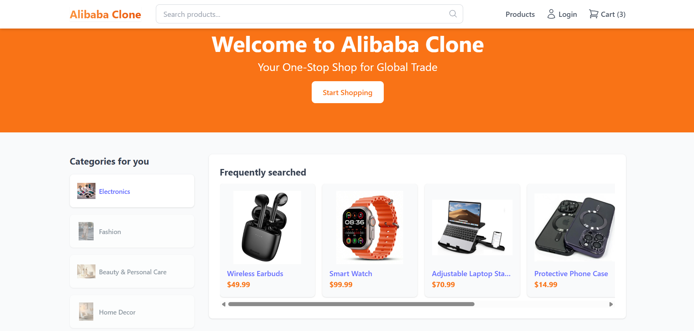
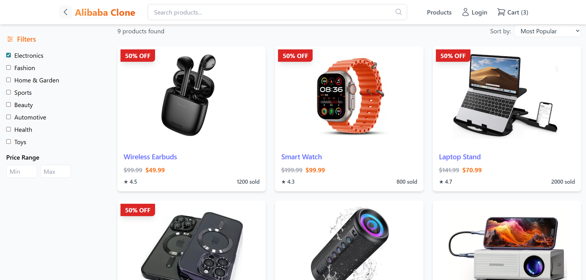
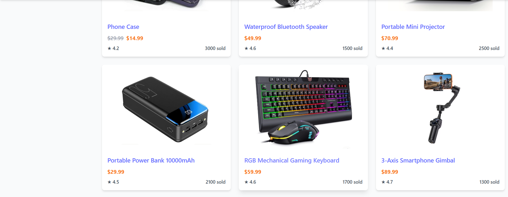
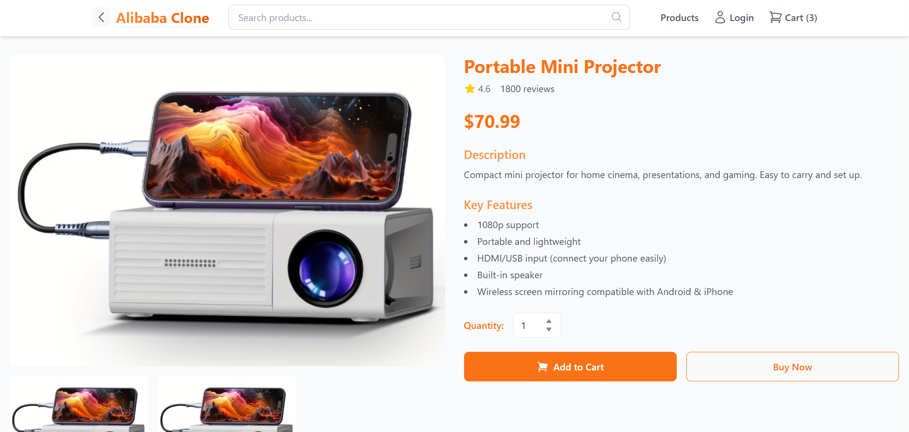
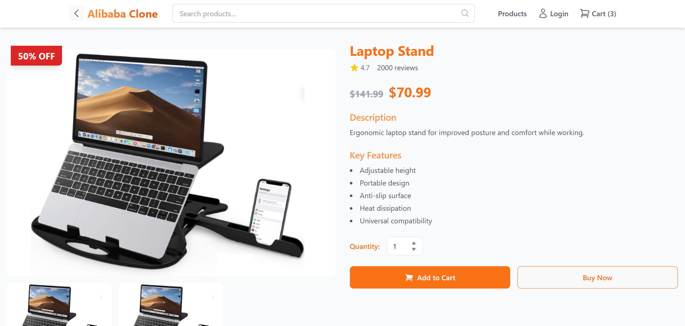
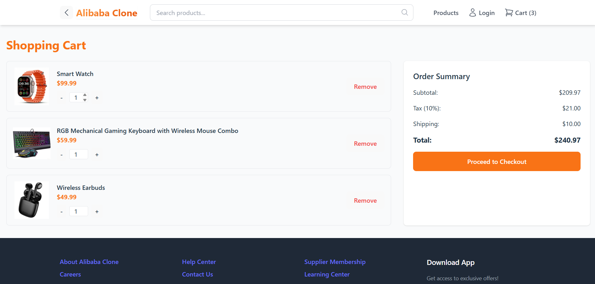
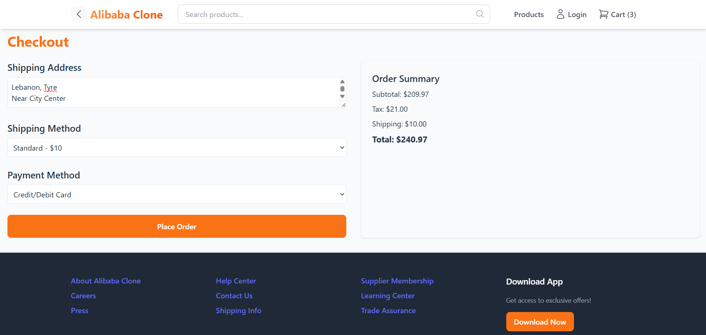
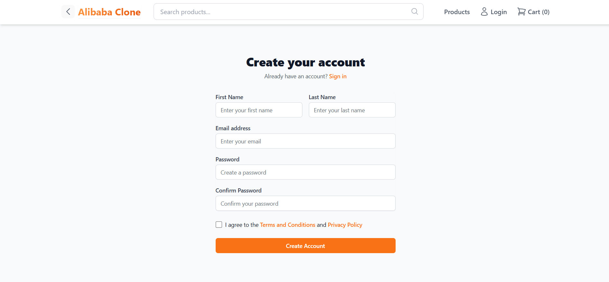

# Alibaba Clone (Frontend Only)

A simple e-commerce frontend inspired by Alibaba, built to practice **React, Vite, TypeScript, and TailwindCSS**.  
This project demonstrates component-based structure, routing, and styling with Tailwind.

---

## 🌐 Live Demo

[Alibaba Clone Live](https://shaymaa-ma.github.io/alibaba-clone/)

---

## 💻 Features

- React + TypeScript for type-safe components  
- Vite for fast development and build  
- TailwindCSS for utility-first styling  
- React Router for page navigation  
- Sample pages: Home, Products, Product Detail, Cart, Checkout, Deals, Login, Register  
- Basic state management using **Context API** and **Redux** (Cart only)  

---

## 🛠 Tech Stack

- **React 18**  
- **TypeScript**  
- **Vite**  
- **TailwindCSS**  
- **Redux + Context API**  
- **React Router DOM**

---

## 🚀 Getting Started

### 1. Clone the repository

```bash
git clone https://github.com/shaymaa-ma/alibaba-clone.git
cd alibaba-clone/client
```
2. Install dependencies

```bash
npm install
```
4. Run locally
```bash
npm run dev
```
Open http://localhost:5173 to see the app running.

⚡ Deploying to GitHub Pages
Set the base path in vite.config.ts:
```bash
base: '/alibaba-clone/',
```
Install gh-pages:
```bash
npm install --save-dev gh-pages
```
Add deploy scripts in package.json:
```bash
"scripts": {
  "predeploy": "npm run build",
  "deploy": "gh-pages -d dist"
}
```
Build and deploy:
```bash
npm run 
```
Your live site: https://shaymaa-ma.github.io/alibaba-clone/

## Screenshots of the UI

### Home Page



### Products Page



### Products Details Page



### Cart Page


### Checkout Page


### Authentication Page
